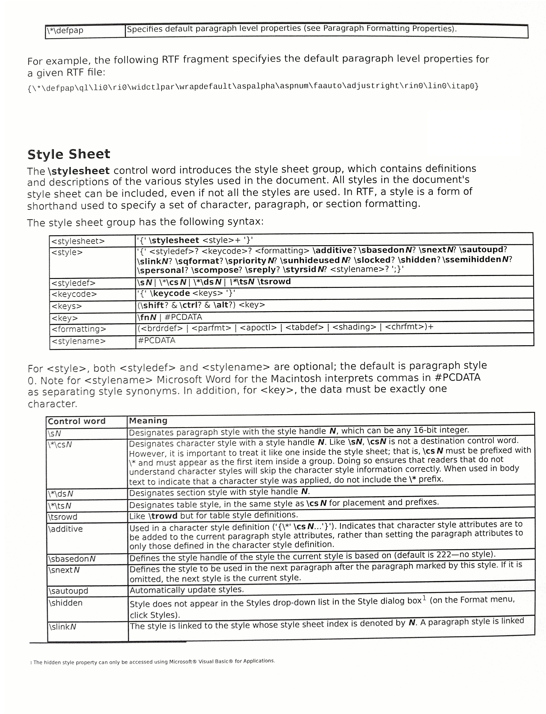
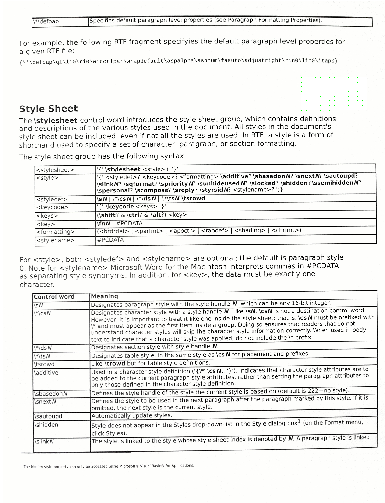

# MIC

> Steganography tool

## What is MIC

The Machine Identification Code (MIC) refers to a unique identifier assigned to a specific device or machine. This code is used for tracking and identifying individual machines within a network or system. It is often used for inventory management, asset tracking, and other administrative purposes to ensure accurate and efficient monitoring of machines in an organization. The MIC is typically a combination of alphanumeric characters that distinguishes each machine from others and facilitates effective management and maintenance.

For more informations, refer to [Wikipedia](https://en.wikipedia.org/wiki/Machine_Identification_Code)

### Usage - Example

For example, we have this image



In this image we must find the MIC code in order to be able to identify the machine and when this document was printed.

You have at your disposal two python scripts allowing to bring out this hidden code in the document.

The script ***get_mic_colored.py*** makes the MIC appear yellow while the other script makes the dots stand out by darkening the image.

```bash
$ python <script.py> <input_image> <output_image>
```

<u>**First script output :**</u>

We can see a MIC at the top left



In this picture we can see the MIC by zooming in on the upper right part of the image

